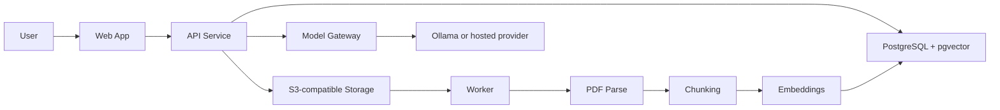

# Chat With Any Document

Senior-level monorepo for a deployable RAG product that lets users chat with PDFs like research papers, legal contracts, notes, and textbooks.

Repository name: `chat-with-any-document`

The repo takes architectural inspiration from [ashwini-961/ask-my-pdf](https://github.com/ashwini-961/ask-my-pdf), especially its local-first browser AI ideas, and restructures them into an industry-style platform that is easier to deploy, scale, and explain in interviews.

## What this repo includes

- `apps/web`: Next.js product surface for upload, chat, citations, and browser-AI feature toggles
- `apps/api`: Fastify API for health, documents, indexing entry points, and grounded chat
- `apps/worker`: ingestion worker for parse -> chunk -> embed -> index flows
- `packages/shared`: shared contracts and runtime config helpers
- `packages/rag-core`: RAG pipeline primitives, prompt builders, chunking, and provider interfaces
- `packages/browser-runtime`: browser-side capability layer inspired by the reference app
- `packages/ui`: shared UI primitives
- `infra/`: Dockerfiles and local PostgreSQL setup
- `docs/`: architecture, deployment, and reference capability notes

## Monorepo design

```text
chat-with-any-document/
|-- apps/
|   |-- api/
|   |-- web/
|   `-- worker/
|-- docs/
|-- infra/
|   |-- docker/
|   `-- postgres/
|-- packages/
|   |-- browser-runtime/
|   |-- rag-core/
|   |-- shared/
|   `-- ui/
|-- docker-compose.yml
|-- package.json
|-- pnpm-workspace.yaml
`-- turbo.json
```

## Architecture



## Reference repo capabilities preserved

The original reference project is strong at browser-native AI. This repo keeps those concepts through `packages/browser-runtime` and the web app:

- browser-side PDF parsing mode
- local embedding mode
- in-memory search mode
- optional WebLLM local inference path
- Gemma, Llama, and Phi browser-model strategy notes

The main upgrade is that those capabilities now sit beside a production-friendly service architecture instead of replacing it.

## Why this structure feels industry-grade

- clean separation between product app, API boundary, worker, and shared domain logic
- deployment-ready infrastructure files from the start
- provider abstractions instead of hardcoding one model vendor
- durable storage for documents and vectors
- cloud portability across AWS, GCP, Azure, Render, Railway, or a VPS
- reusable packages instead of duplicated app logic

## Local stack

`docker-compose.yml` defines the local platform:

- `web`
- `api`
- `worker`
- `postgres` with `pgvector`
- `minio` for S3-compatible object storage
- `ollama` for local open-source models

## Current starter behavior

This repo is scaffolded as a serious starter rather than a finished product:

- the web app presents the product shell and capability story
- the API exposes health, document creation, demo indexing, and grounded chat endpoints
- the worker demonstrates ingestion reporting
- shared packages already model contracts, chunking, prompts, vector search abstractions, and browser-runtime capabilities

The API currently includes a mock in-memory RAG path so the repo has a coherent execution flow before the real storage and model integrations are added.

## Suggested next implementation steps

1. Replace the mock vector store with real PostgreSQL `pgvector` persistence.
2. Add real PDF extraction in the worker.
3. Add S3 or MinIO upload handling in the API.
4. Connect the web upload UI to `/v1/documents`.
5. Swap the mock chat and embedding providers with Ollama-backed adapters.
6. Add authentication and per-user document scoping.
7. Add tests for chunking, retrieval, and API contracts.
8. Add CI for lint, typecheck, and integration smoke tests.

## Recruiter explanation

"I built this as a monorepo because the product has three separate execution concerns: the user-facing web app, the stateless API, and the background ingestion worker. Shared contracts and RAG logic live in reusable packages, so the architecture stays consistent while remaining easy to deploy on AWS or any container platform."

## Useful docs

- [Architecture](./docs/architecture.md)
- [Deployment](./docs/deployment.md)
- [Reference capability mapping](./docs/reference-capabilities.md)
